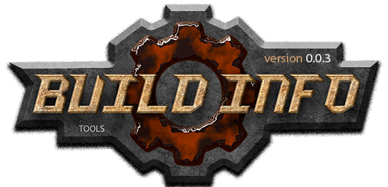

[](docs/home.md "for developers")  

Logging build information
=========================
Печатает в лог компиляции информацию о сборке.  

Пример использования:  

```
// pch.hpp

// главный файл модуля
#include <build_info.hpp>  

#define dEXAMPLE_MAJOR 2
#define dEXAMPLE_MINOR 0
#define dEXAMPLE_PATCH 6

// вывод информации в лог компиляции
dSHOW_BUILD("[example]", dEXAMPLE)
```

Вывод в консоль:  
```
2>__cplusplus: 201703L
2>c++17: enabled
2>msvc2019 .......... 16.10.1
2>_MSC_FULL_VER ..... 192829915
2>_MSVC_LANG ........ 201703L
2>_MSC_EXTENSIONS ... enabled
2>[example] enabled -> pch
2>[example] UNSTABLE-DEBUG
2>[example] MTd (debug-static runtime c++)
2>[example] 2.0.6, x64-debug-MTd, unstable
```

Вывод сообщений можно отключить:  
```
dHIDE_CLANG_MESSAGE
dHIDE_MINGW_MESSAGE
dHIDE_MSVC_MESSAGE
dHIDE_GCC_MESSAGE
```

Формат сообщений для clang, gcc, или mingw,  
можно улучшить, если задействовать опции:  
`-ftrack-macro-expansion=0 -fno-diagnostics-show-caret`

Сценарий [Minimalist][Minimalist] включает эти опции автоматически:  

```
if(NOT gVERBOSE_OUTPUT)
    set (build_options "-ftrack-macro-expansion=0 -fno-diagnostics-show-caret")
endif()
```

[Minimalist]: https://github.com/Kartonagnick/cmake-minimalist
    "Minimalist - Универсальный сценарий сборки на языке cmake."  

1) [Документация](docs/table.md)  
2) [История](docs/history.md)  
